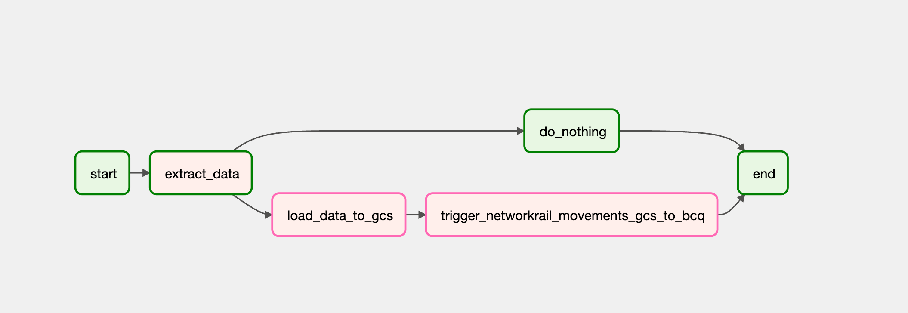
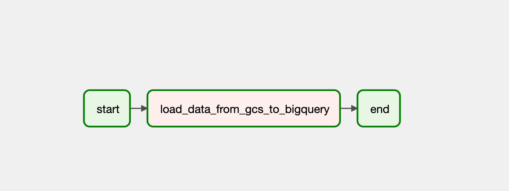
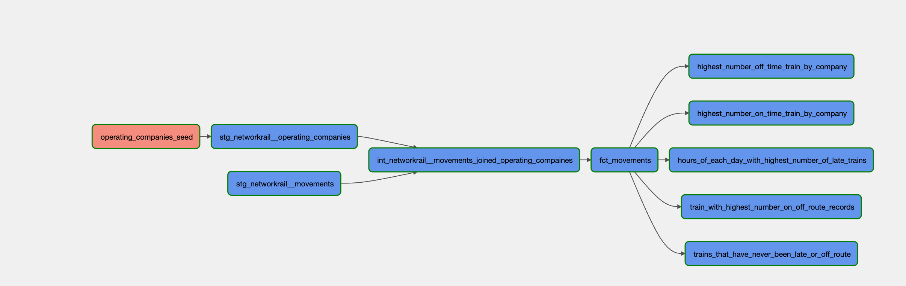
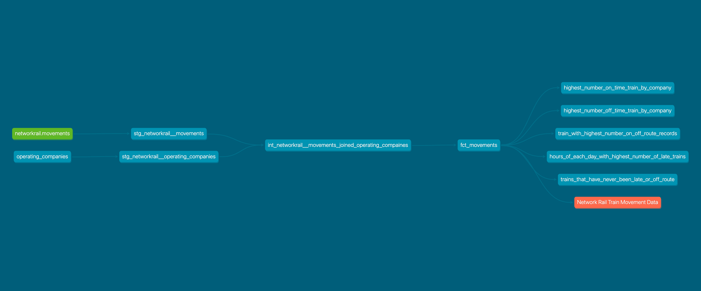

# Data Engineering Project - Railway

This project showcases my learnings from the Data Engineering Bootcamp course.

To learn more about the course, visit [Data Engineering Bootcamp by Skooldio](https://landing.skooldio.com/data-engineering-bootcamp).

## Table of Contents
- [Setup](#setup)
- [Preparation](#preparation)
- [Pipeline Design](#pipeline-design)
- [Dashboard](#dashboard)

## Setup
To create the project image, use the provided `Dockerfile` and `docker-compose.yaml`.

### Prerequisites
- Install Docker: [Instructions](https://docs.docker.com/engine/install/)
- Download/Clone the repository
- On Linux systems, navigate to the project folder.

### Preparation
Before running Airflow, follow these steps:
- Access a NetworkRail Postgres Database.
- Obtain Google Cloud Storage (GCS) / Google Big Query (BCQ) credentials and configure a bucket.

Run the following command to prepare Airflow:
```sh
mkdir -p ./dags ./logs ./plugins ./tests ./dbt
echo -e "AIRFLOW_UID=$(id -u)" > .env
```

To run Airflow, execute the command:
```sh
docker compose up --build
```

The project is structured as follows:
- dags: Contains the Airflow DAGs that orchestrate the data engineering process.
- dbt: Contains the dbt project that transforms the data.
- plugins: Contains the Airflow plugins that are used by the project.
- tests: Contains the unit tests for the project.


## Pipeline Design
This project includes four pipelines:

### 1) Ingestion
The first pipeline extracts data from a NetworkRail Postgres Database and loads it into Google Cloud Storage (GCS).

- Data Source: [NetworkRail Data Feeds](https://datafeeds.networkrail.co.uk/ntrod/)
- Field Description: [Train Movement](https://wiki.openraildata.com/index.php?title=Train_Movement)

In the `networkrail_movements_to_gcs.py` file, the following steps are performed:
1. Extract Data: The `extract_data` task connects to the NetworkRail Postgres Database and retrieves data for a specific date. If data is found, it is saved as a CSV file in the local directory.
2. Load Data to GCS: The `load_data_to_gcs` task uploads the extracted CSV file to Google Cloud Storage (GCS) using the Google Cloud Storage Python library. The file is stored in a specified bucket with a predefined structure.
3. Trigger Another DAG: The `trigger_networkrail_movements_gcs_to_bcq` task triggers another DAG named "networkrail_movements_gcs_to_bcq" to process the data uploaded to GCS. The execution date is passed as a parameter to the triggered DAG.

Airflow dags


### 2) Data Warehouse
The second pipeline loads data from Google Cloud Storage (GCS) into Google BigQuery for further analysis and processing. In the `networkrail_movements_gcs_to_bcq.py` file, the following step is performed:
- Load Data from GCS to BigQuery: The `load_data_from_gcs_to_bigquery` task loads data from CSV files stored in a specified GCS bucket into a BigQuery table. The CSV files contain the NetworkRail Movements data with a predefined schema.

Airflow dags


### 3) Enrichment using dbt (data build tool)
After data is updated in BigQuery, dbt is used to transform the data using analytics engineering best practices. The transformation process involves three layers:

- **Staging Layer**: This layer references sources from the data warehouse, without any joining. In this project, there are two staging models: `stg_networkrail__movements` (referencing the `movement` table in BigQuery) and `stg_networkrail__operating_companies` (referencing the `operating_companies.csv` file using dbt seed function for import).

- **Intermediate Layer**: This layer prepares staging models for joining the desired entities. The project includes one intermediate

 model: `int_networkrail__movements_joined_operating_companies`, which joins the `movements` and `operating_companies` tables for use in the mart layer.

- **Mart Layer**: This layer focuses on business entities and processes. The project includes one facts model (`fct_movements`) and five dimensions models: `highest_number_off_time_train_by_company`, `highest_number_on_time_train_by_company`, `hours_of_each_day_with_highest_number_of_late_trains`, `train_with_highest_number_on_off_route_records`, and `trains_that_have_never_been_late_or_off_route`.
Airflow dbt-Dags 


This is completed Data Lineage that created from dbt


### 4) Dashboard
The project includes a simple dashboard to visualize the transformed data using dbt.

- Dashboard: [Dashboard](https://lookerstudio.google.com/reporting/f4a2176f-b012-4c90-a7f9-5f9fd0e18519)


### Some ideas for future projects:

- Add more data sources, such as weather data.
- Develop more complex data transformations.
- Create a more sophisticated dashboard with more features.
- Include more data models and diagrams